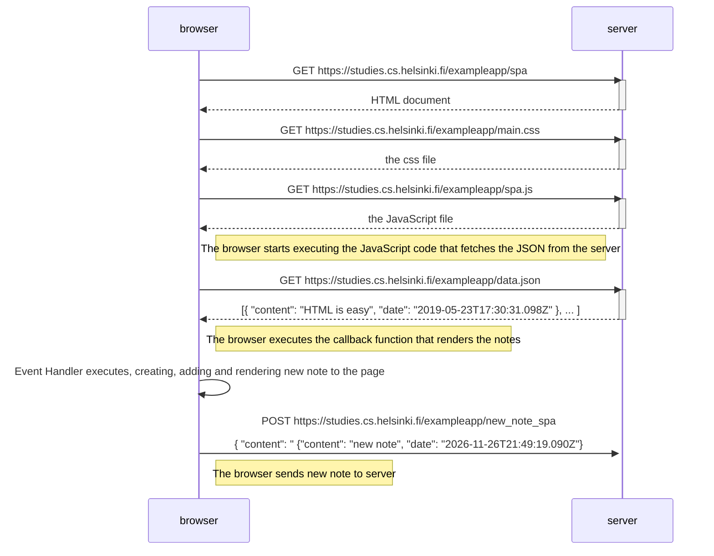

```mermaid
sequenceDiagram
    participant browser
    participant server

    browser->>server: GET https://studies.cs.helsinki.fi/exampleapp/spa
    activate server
    server-->>browser: HTML document
    deactivate server

    browser->>server: GET https://studies.cs.helsinki.fi/exampleapp/main.css
    activate server
    server-->>browser: the css file
    deactivate server

    browser->>server: GET https://studies.cs.helsinki.fi/exampleapp/spa.js
    activate server
    server-->>browser: the JavaScript file
    deactivate server

    Note right of browser: The browser starts executing the JavaScript code that fetches the JSON from the server

    browser->>server: GET https://studies.cs.helsinki.fi/exampleapp/data.json
    activate server
    server-->>browser: [{ "content": "HTML is easy", "date": "2019-05-23T17:30:31.098Z" }, ... ]
    deactivate server

    Note right of browser: The browser executes the callback function that renders the notes

    browser->>browser: Event Handler executes, creating, adding and rendering new note to the page
    activate server

    browser->>server: POST https://studies.cs.helsinki.fi/exampleapp/new_note_spa<br><br>{ "content": " {"content": "new note", "date": "2026-11-26T21:49:19.090Z"}

    Note right of browser: The browser sends new note to server
```
